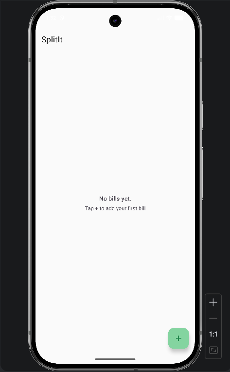
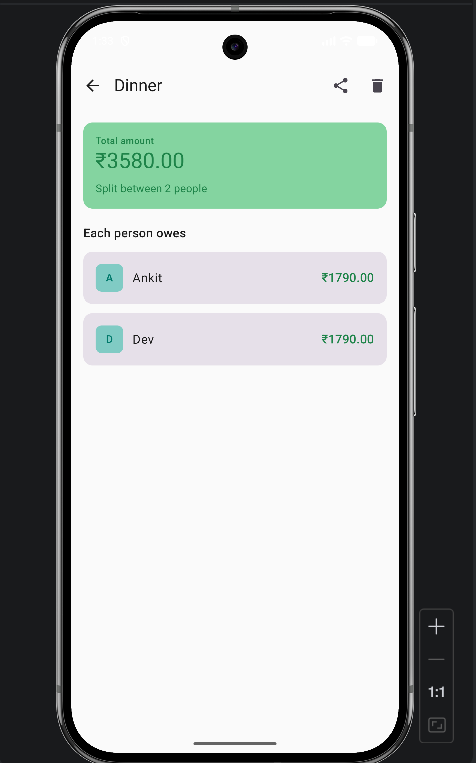
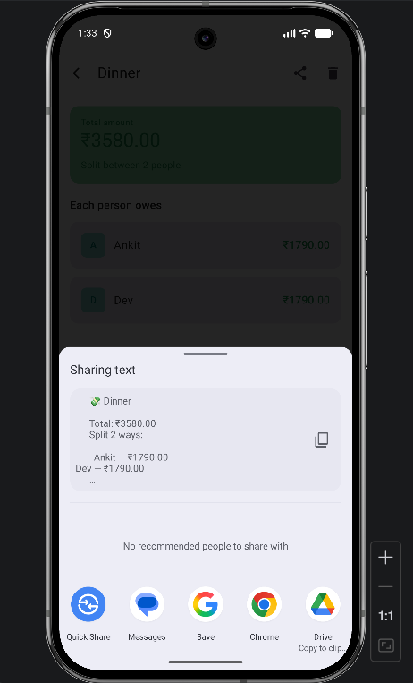
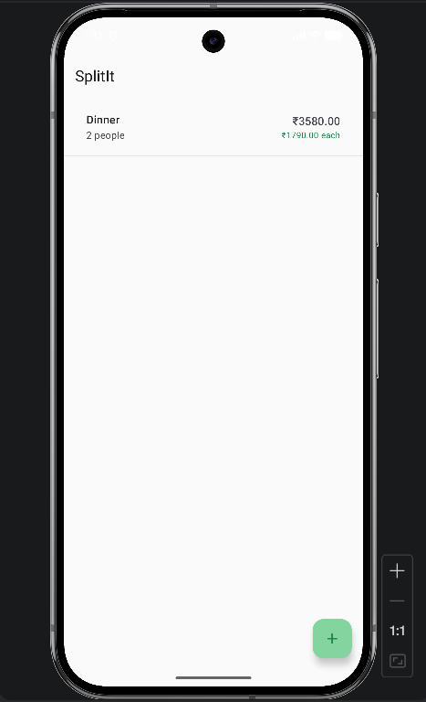

# SplitIt 💸

A clean, offline-first Android bill splitting app built with Kotlin and Jetpack Compose.

## Screenshots

    
    
    
    

## Features
- Add bills with named participants
- Automatic equal split calculation with live preview
- Per-person breakdown on the detail screen
- Swipe to delete bills
- Share bill summary via any app (WhatsApp, Messages, etc.)
- Fully offline — no account or internet required

## Tech Stack
- **Language:** Kotlin
- **UI:** Jetpack Compose + Material3
- **Architecture:** MVVM (ViewModel + StateFlow)
- **Storage:** JSON file persistence (no external DB dependencies)
- **Navigation:** Navigation Compose

## Architecture
com.example.splitit/
├── data/          # Bill model + JSON storage
├── ui/            # All Compose screens + navigation
├── viewmodel/     # BillViewModel with StateFlow
└── MainActivity   # Entry point

## What I learned
- Jetpack Compose declarative UI and state management
- MVVM architecture with AndroidViewModel and StateFlow
- Navigation Compose with argument passing between screens
- Android share sheet integration via Intents
- Material3 theming with custom color schemes
- Swipe-to-dismiss gesture handling in Compose

## Setup
1. Clone the repo
2. Open in Android Studio
3. Run on emulator or physical device (API 26+)
